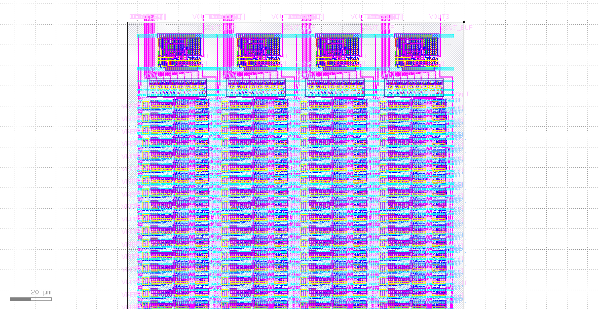

# 4x8bit_dac
4 x 8 Bit DAC taget to openroad/openlane flow and sky130 foundary
|  | 
|:--:| 
| *4 x 8_bit_DAC (dac_top.gds)* |

This analog layout part is done using https://github.com/iic-jku/iic-osic-tools docker container.

This environment is based on the efabless.com FOSS-ASIC-TOOLS.

IIC-OSIC-TOOLS is an all-in-one Docker container for open-source-based integrated circuit designs for analog and digital circuit flows.

# Prerequisites
```bash
   #Step-1: Installing Docker in WSL2 Ubuntu
   sudo apt update
   sudo apt install docker.io -y

```
Next check the docker version 
```
   docker --version
```
Then modify the visudo file
```
   sudo visudo
```
In which enter these 
```
   # Docker daemon specification
   pramit ALL=(ALL) NOPASSWD: /usr/bin/dockerd
```
You can replace pramit with your username.
Then adding some text to ~/.bashrc file.
```
   nano ~/.bashrc
```
Add these to the end of the file.
```
# Start Docker daemon automatically when logging in if not running.
RUNNING=`ps aux | grep dockerd | grep -v grep`
if [ -z "$RUNNING" ]; then
    sudo dockerd > /dev/null 2>&1 &
    disown
fi
```
Then add your username to docker group so you can run docker as a non-root user.
```
   sudo usermod -aG docker $USER
```
Then restart WSL terminal to check if docker is successfully installed using ``docker run hello-world``, it should print a Hello World message, after which it is done.

# Pulling and setting up Docker image using a script
Download a script file from this link https://raw.githubusercontent.com/iic-jku/iic-osic-tools/main/start_vnc.sh which is ``start_vnc.sh``

Now to setup our personal design directory, which will be the directory shared between us and the docker container by editing the ``start_vnc.sh`` file as follows.


Now we are ready to start the script by 
```
./start_vnc.sh
```
After the image is pulled successfully a VNC server will be started at ``localhost:5901`` with password ``abc123``.
We can connect to this server via any web browser by going to http://localhost/?password=abc123.
But the recommended way is to connect to the server using TigerVNC viwer.
which can be downloaded from https://sourceforge.net/projects/tigervnc/files/latest/download.

Connection screen of TigerVNC viewer 


The benefit of using this container is the easy and quick setup. Moreover it has tons of latest installed packages and pdks. Which would take a lot of time if installed locally, one after another.


# Run the Klayout FEOL/BEOL/Density/Zero Area/overlapping check
```bash
   cd PostLayout
   ./run_precheck
```

# Post Layout Simulation
```bash
   ngspice resistor_test.spice
```
   <table> <tr> <td  align="center"></td> </tr> </table>

```bash
   ngspice switch_test.spice
```
   <table> <tr> <td  align="center"></td> </tr> </table>

```bash
   ngspice switch2_test.spice
```
   <table> <tr> <td  align="center"></td> </tr> </table>


```bash
   ngspice switch2n_test.spice
```
   <table> <tr> <td  align="center"></td> </tr> </table>

```bash
   ngspice 2bit_DAC_test.spice 
```
   <table> <tr> <td  align="center"></td> </tr> </table>

```bash
   ngspice 3bit_DAC_test.spice 
```
   <table> <tr> <td  align="center"></td> </tr> </table>

```bash
   ngspice 4bit_DAC_test.spice 
```
   <table> <tr> <td  align="center"></td> </tr> </table>

```bash
   ngspice 5bit_DAC_test.spice 
```
   <table> <tr> <td  align="center"></td> </tr> </table>

```bash
   ngspice 6bit_DAC_test.spice 
```
   <table> <tr> <td  align="center"></td> </tr> </table>

```bash
   ngspice 7bit_DAC_test.spice 
```
   <table> <tr> <td  align="center"></td> </tr> </table>

```bash
   ngspice 8bit_DAC_test.spice 
```
   <table> <tr> <td  align="center"></td> </tr> </table>

# Reference
Basic idea and register and switch picked from 
* **avsddac_3v3_sky130_v2 Aim** - https://github.com/vsdip/avsddac_3v3_sky130_v2
