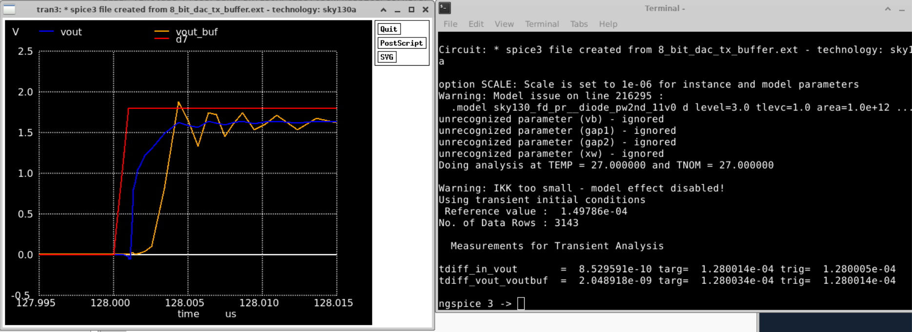
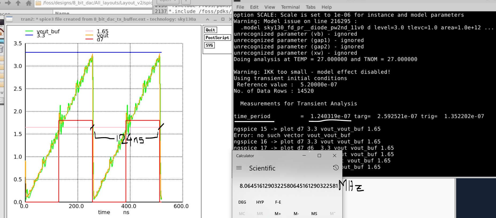
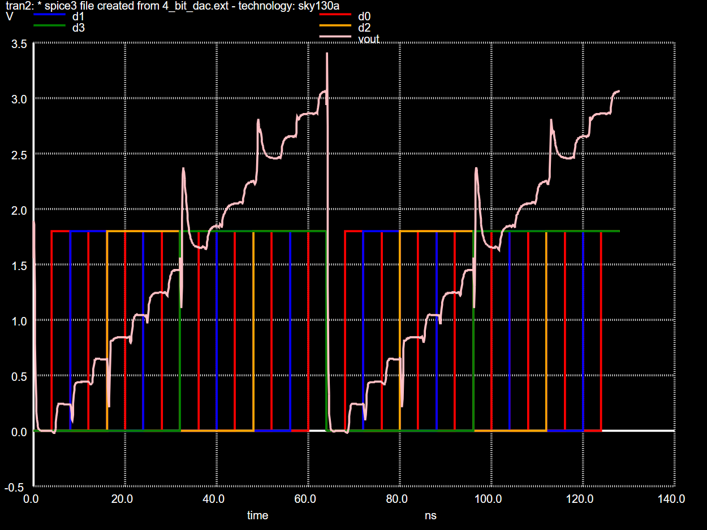
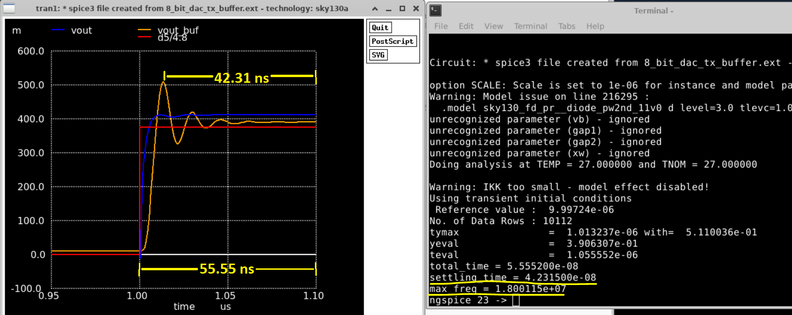
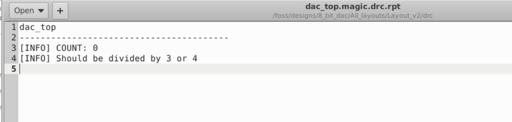

# 4x8bit_dac
4 x 8 Bit DAC taget to openroad/openlane flow and sky130 foundry. The latest Layouts and spice files can be found in [Layout_v2](https://github.com/pramitpal/8bit_dac/tree/main/Layout_v2) directory.

|  | 
|:--:| 
| *4 x 8_bit_DAC (dac_top.gds)* |

This analog layout part is done using https://github.com/iic-jku/iic-osic-tools docker container.

This environment is based on the efabless.com FOSS-ASIC-TOOLS.

IIC-OSIC-TOOLS is an all-in-one Docker container for open-source-based integrated circuit designs for analog and digital circuit flows.

# Prerequisites
```bash
   #Step-1: Installing Docker in WSL2 Ubuntu
   sudo apt update
   sudo apt install docker.io -y

```
Next check the docker version 
```
   docker --version
```
Then modify the visudo file
```
   sudo visudo
```
In which enter these 
```
   # Docker daemon specification
   pramit ALL=(ALL) NOPASSWD: /usr/bin/dockerd
```
You can replace pramit with your username.
Then adding some text to ~/.bashrc file.
```
   nano ~/.bashrc
```
Add these to the end of the file.
```
# Start Docker daemon automatically when logging in if not running.
RUNNING=`ps aux | grep dockerd | grep -v grep`
if [ -z "$RUNNING" ]; then
    sudo dockerd > /dev/null 2>&1 &
    disown
fi
```
Then add your username to docker group so you can run docker as a non-root user.
```
   sudo usermod -aG docker $USER
```
Then restart WSL terminal to check if docker is successfully installed using ``docker run hello-world``, it should print a Hello World message, after which it is done.

# Pulling and setting up Docker image using a script
Download a script file from this link https://raw.githubusercontent.com/iic-jku/iic-osic-tools/main/start_vnc.sh which is ``start_vnc.sh``

Now to setup our personal design directory, which will be the directory shared between us and the docker container by editing the ``start_vnc.sh`` file as follows.


Now we are ready to start the script by 
```
./start_vnc.sh
```
After the image is pulled successfully a VNC server will be started at ``localhost:5901`` with password ``abc123``.
We can connect to this server via any web browser by going to http://localhost/?password=abc123.
But the recommended way is to connect to the server using TigerVNC viwer.
which can be downloaded from https://sourceforge.net/projects/tigervnc/files/latest/download.

Connection screen of TigerVNC viewer 


The benefit of using this container is the easy and quick setup. Moreover it has tons of latest installed packages and pdks. Which would take a lot of time if installed locally, one after another.

# Generation of lef files from the layout
To generate the .lef files, all the labels in the layout must be made to ports with the port index, class and use properly set.
To make and change a label
```
label <name> <direction(n/s/e/w)> <layer>
```
To erase a label
```
erase label
```
Now to convert a label to a port with the index, class and use
```
port make <port_index>
port class <class>
port use <use>
```
where the valid classes can be: __default, input, output, tristate, bidirectional, inout, feedthrough, and feedthru__

The valid uses can be : __default, analog, signal, digital, power, ground, and clock__

To set a port to be used as an input we have used 
``port class input`` and ``port use signal``.

To set a port to be used as a ground ``port class inout`` and ``port use ground``

To use as a power port ``port class inout`` and ``port use power``.

To set a port as an output port, ``port class output`` and ``port use signal`` are used.

These settings ensure that each of these ports/pins appear correctly in the extracted .lef files.

To extract .lef files from magic after setting all the ports use
```
lef write <filename.lef> -hide
```
A correct lef file screenshot is shown below.


# Running LVS check on the layout and the schematic file
In order to generate the netlist from xschem for running lvs, ``LVS netlist: Top level is a .subckt`` must be checked before netlist extraction. This can be found under the simulation dropdown menu. Now we have generated the prelayout spice netlist.

To generate the post-layout netlist, we will be needing magic. The extraction commands must be run properly to ensure a lvs type netlist is generated with .subckt in the file.
```
select top cell
extract all
ext2spice lvs
ext2spice
```
Before continuing it must be ensured that both the top level subckt has the same name.

Now lvs check is done by netgen which is done by
```
netgen -batch lvs "$NETLIST_LAY $TOPCELL" "$NETLIST_SCH $TOPCELL" \
		"$PDK_ROOT/$PDK/libs.tech/netgen/${PDK}_setup.tcl" \
		comp.out
```
The output report is stored in the current directory itself. If the two netlists match, it will be displayed in the ``comp.out`` file as:

``Final result: Circuits match uniquely.``
# Measurement of 8-bit DAC characteristics
First the netlist for 8_bit_dac_tx_buffer.mag layout is extracted without parasitics from which we can calculate a rough estimate of the time delay between the input signal and the buffered DAC output.
To extract the netlist without parasitics we use
```
port makeall
extract all
ext2spice scale off
ext2spice cthresh infinite rthresh infinite
ext2spice
```
For measuring the time delay we have given a step input to the D7 input pin and then measured the delay using ngspice builtin commands.
```
.measure tran tdiff_in_vout TRIG v(D7) VAL=0.9 RISE=1 TARG v(VOUT) VAL=0.828 RISE=1
.measure tran tdiff_vout_voutbuf TRIG v(VOUT) VAL=0.828 RISE=1 TARG v(VOUT_BUF) VAL=0.828 RISE=1
```
This gives us two values:
a. Time delay between the D7 input to the unbuffered output
b. Time taken for the buffer to give an output voltage.

Then we can calculate the total time delay between input and output for one buffered 8-bit DAC.
D7->VOUT = 0.853 ns
VOUT->VOUT_BUF = 2.04 ns
Total delay= 2.04ns + 0.853ns = 2.893ns



In order to measure the output frequency of the output waveform we use 
```
.measure tran time_period TRIG v(VOUT_BUF) VAL=1.65 FALL=1 TARG v(VOUT_BUF) VAL=1.65 FALL=2
```
which for this netlist gives us a value of time_period of 124ns which if calculated turns out to be ``8.0645 MHz``.



This is not the most accurate way to find out the characteristics, for the most accurate one we have to perform full RCX extraction which takes care of distributed parasitic resistance and capacitances.
To do that we can run these commands in magic but first we have to convert all top level labels to ports so that we have a top .subckt with ports.
After that we need to flatten the cell to do the extraction, so step by step 
```
select top cell
flatten <cellname_flat>
load <cellname_flat>
select top cell
extract all
ext2sim labels on
ext2sim
extresist tolerance 10
extresist
ext2spice lvs 
ext2spice cthresh 1
ext2spice extresistor on
ext2spice
```

This will give us a huge netlist which we can use for the most correct simulation.



The simulation takes a lot of time to converge so we are using just the transient analysis only which can be specified using 

``` 
.tran 1n 100n uic
```
Next our task is to characterize the DAC using the full RCX netlist, which are:

1. Transfer Function
2. Output Voltage Range
3. Differential Nonlinearity (DNL)
4. Integral Nonlinearity (INL)
5. Power Supply Rejection Ratio (PSRR)
6. Output Impedance
7. Settling Time

A. Settling Time: Refers to the time it takes for the output voltage of the DAC to stabilize within a specified error band after a change in the digital input code. By simulating the DAC's response to different input code transitions, we can calculate the settling time.
In ngspice we use the ``.meas`` to find the settling time. We are finding the time the buffered output settles within 1% error of the desired voltage. The control commands are as follows:
```
******************************************************
Vin D5 0 PWL(0 0 1u 0 1.0001u Vhigh)

.tran 1n 10u uic

.control
run
****************measuring settling_time***************
meas tran tymax MAX_AT v(vout_buf) from=0.1u to=10u
meas tran yeval FIND v(vout_buf) AT=10u
let tol=0.99*yeval
meas tran teval WHEN v(vout_buf)=tol CROSS=LAST
let settling_time=(teval-tymax)
let total_time=(teval-1e-06)
let max_freq=1/total_time
******************************************************
print total_time
print settling_time
print max_freq
```

B. Maximum Frequency: This property is heavily dependet on the parasitics and the circuit design itself and can be calculated by 

```
Max_frequency = 1/ total_time
```
Which we found out to be ``1/ 55.55ns = 18.001 MHz``.

| 	Sl. no.	 | 	Property	 | 	Value	 | 
| 	:-----:	 | 	:-----:	 | 	:-----:	 | 
| 	1	| 	Settling Time	| 	42.3 ns	 | 
| 	2	| 	Total Time	| 	55.55 ns	 | 
| 	3	| 	Maximum Frequency	| 	18.001 MHz	 | 
| 	4 	| 	Minimum Output Voltage | 	0.02 V	 | 
| 	5	| 	Maximum Output Voltage | 	3.23 V	 | 

# Run the DRC checks using magic and Klayout (FEOL/BEOL/Density/Zero Area/overlapping) check
In order to do the extensive DRC check we use both magic and Klayout to give us the DRC check reports.
But first we need to make the .gds file for the dac_top which can be done by 
```
gds write dac_top.gds
```
We have a well written DRC checking script which can be used for both magic and Klayout. If we use the script without any netlist we can see the help page which shows the various arguments.

```
DRC script for Magic-VLSI and KLayout (IIC@JKU)

Usage: /foss/tools/osic-multitool/iic-drc.sh [-d] [-m|-k|-b|-c] <cellname>
       -m Run Magic DRC (default)
       -k Run KLayout DRC
       -b Run Magic and KLayout DRC
       -c Clean output files
       -d Enable debug information
```

For Magic:
```
./iic-drc.sh -m dac_top
```
After which we will have a ``dac_top.magic.drc.rpt`` file which gives us a list of all the errors which in our case is clean.



For Klayout checks:
```
./iic-drc.sh -k dac_top
```
We will get 5 xml files with all the error reports(if any) which are all clean for our case.
Note: These xml files can be imported into the klayout view of the gds by which we can see exactly where our DRC error is in the layout.


# Post Layout Simulation


```bash
   ngspice 8bit_DAC_test.spice 
```
   <table> <tr> <td  align="center"></td> </tr> </table>

# Reference
Basic idea and register and switch picked from 
* **avsddac_3v3_sky130_v2 Aim** - https://github.com/vsdip/avsddac_3v3_sky130_v2
